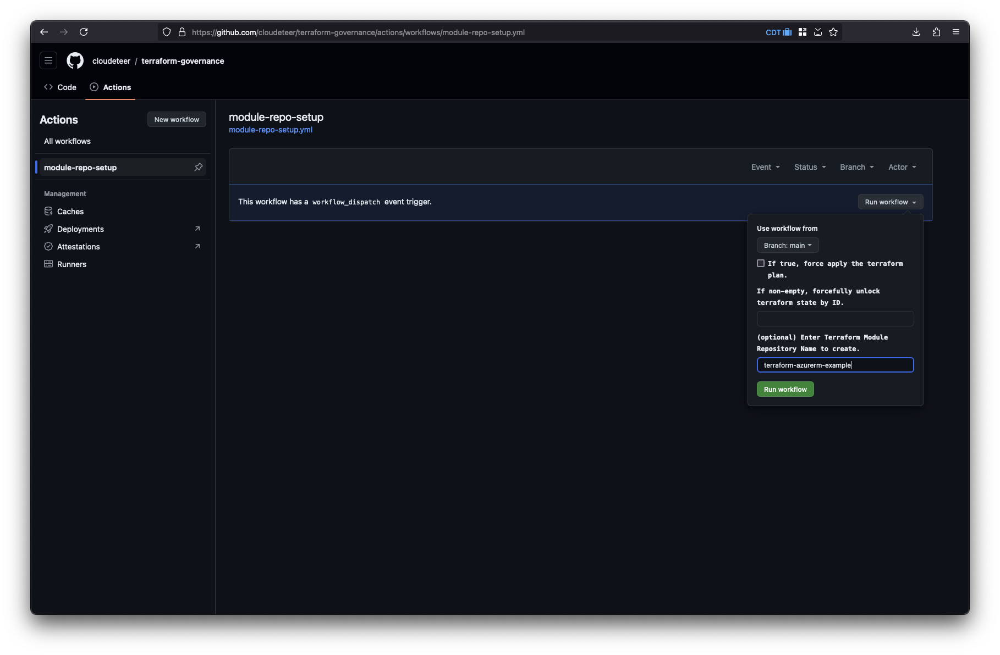
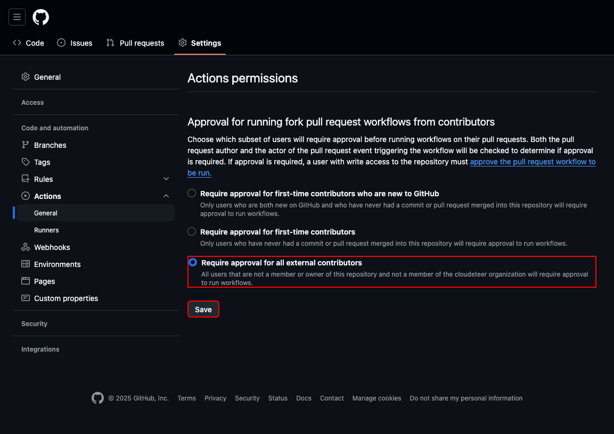

# Creating a New Terraform Module

This documentation provides a step-by-step guide for creating and releasing a new Terraform module within our organization.

## Table of Contents

- [Table of Contents](#table-of-contents)
- [1. Create GitHub Repository](#1-create-github-repository)
  - [1.1 Use Terraform Governance GitHub Actions Workflow](#11-use-terraform-governance-github-actions-workflow)
  - [1.2 Install DCO Application](#12-install-dco-application)
- [2. Develop the Module](#2-develop-the-module)
  - [2.1 Create Development Branch](#21-create-development-branch)
  - [2.2 Push and Open a Pull Request](#22-push-and-open-a-pull-request)
  - [2.3 Merge and Release](#23-merge-and-release)
- [3. Publish the Module](#3-publish-the-module)
  - [3.1 Terraform Registry](#31-terraform-registry)
  - [3.2 OpenTofu Registry](#32-opentofu-registry)
- [4. Spread the Word](#4-spread-the-word)

## 1. Create GitHub Repository

A **public** GitHub repository in the name format `terraform-<PROVIDER>-<NAME>` ([details](https://developer.hashicorp.com/terraform/registry/modules/publish#requirements)) is required as the foundation for the new Terraform module. To create a new repository, use the predefined GitHub Actions workflow that ensures the repository is correctly configured according to our standards.

### 1.1 Use Terraform Governance GitHub Actions Workflow

To trigger the workflow using the `gh` CLI:

```shell
# Set the repository name
REPOSITORY_NAME=terraform-azurerm-example

gh workflow run module-repo-setup \
  --repo cloudeteer/terraform-governance \
  --raw-field create_repo=${REPOSITORY_NAME:?}
```

Alternatively, you can run the workflow through the GitHub web interface:

<details>
<summary>GitHub Actions Screenshot</summary>



</details>

> [!IMPORTANT]
> Currently, the GitHub API does not support configuring the "**Approval for running fork pull request workflows from contributors**" permission to "**Require approval for all external contributors**" in the repository action settings. As a result, this setting must be manually configured via the GitHub Web UI under **Repository Settings** > **Actions** > **General**.
> 

### 1.2 Install DCO Application

To ensure compliance with our contribution guidelines, install and configure the DCO (Developer Certificate of Origin) GitHub application. This step requires GitHub Org Admin permissions.

_TODO: Provide instructions for installing and configuring the DCO App._

## 2. Develop the Module

Once the GitHub repository is set up, begin developing the new module. The procedure is as follows:

### 2.1 Create Development Branch

First, create a development branch from the latest `main` branch:

```shell
REPOSITORY_NAME=terraform-azurerm-example

git clone git@github.com:cloudeteer/${REPOSITORY_NAME:?}.git
cd ${REPOSITORY_NAME:?}

git checkout --branch add-module
```

### 2.2 Push and Open a Pull Request

After finishing development, push the development branch to the remote repository and create a pull request:

```shell
git push --upstream origin add-module
gh pr create
```

### 2.3 Merge and Release

Once the pull request is reviewed and approved, merge it. This action triggers the `release` GitHub Actions workflow, which will:

- Create a Git tag following semantic versioning
- Generate a GitHub release based on that tag

## 3. Publish the Module

### 3.1 Terraform Registry

Official documentation from HashiCorp on publishing modules: <https://developer.hashicorp.com/terraform/registry/modules/publish>

Requirements from the Terraform Registry (which is already done):

- The GitHub App "Terraform Registry" needs permissions to read repositories and create webhooks in the [cloudeteer](https://github.com/cloudeteer) GitHub organization. This was initially set up in issue <https://github.com/cloudeteer/tf-mod-lib/issues/360>.

Requirements from Cloudeteer:

- Modules must be published using the [cloudeteerbot](https://github.com/cloudeteerbot) GitHub user.

Step-by-step guide:

1. Log in to the [Terraform Registry](https://registry.terraform.io/) with the [cloudeteerbot](https://github.com/cloudeteerbot) GitHub user (see Keeper for credentials).
2. Publish a new module as documented in the HashiCorp Terraform Registry documentation: <https://developer.hashicorp.com/terraform/registry/modules/publish#publishing-a-public-module>

During the initial publishing of a Terraform module in the Terraform Registry, the "Terraform Registry" GitHub App installs a webhook in the GitHub repo of the Terraform module. This webhook ensures that on a _tag-push_ (Semantic Version), the module is automatically published in the Terraform Registry. Official HashiCorp documentation: <https://developer.hashicorp.com/terraform/registry/modules/publish#releasing-new-versions>

### 3.2 OpenTofu Registry

Follow the module publishing notes at <https://opentofu.org/docs/language/modules/develop/publish/>.

At the time of writing this documentation, the steps are:

1. Create a GitHub issue "Submit new Module" in <https://github.com/opentofu/registry/> filling out all required fields. The user who submitted the issue, does not matter.
2. Wait for the request to be processed and approved. A pull request will be created and merged. (Approx. 15 min)

Issue-Example: <https://github.com/opentofu/registry/issues/635>

Once a module is registered in the OpenTofu registry, OpenTofu automation will automatically monitor for new releases of the registered module. This is done by watching for new Git tags in Semantic Version format. Pushing such a tag will trigger a new release on OpenTofu, similar to how it works on Terraform. No further action is required from the module developers.

## 4. Spread the Word

Our organization values open-source contributions, and all Terraform modules are open source. After the initial release of a new module, it’s important to promote it. Contact @neonwhiskers for guidance on spreading the word about your new module.
