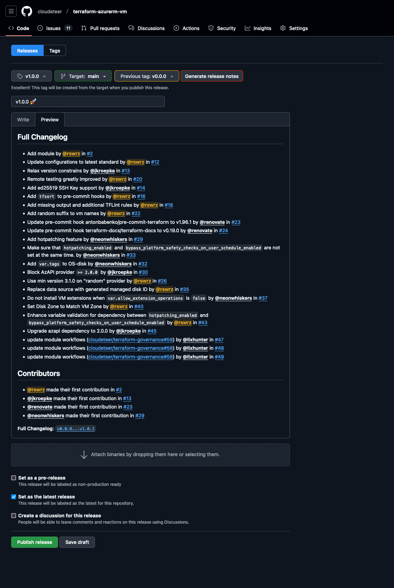

# Module Release

This document describes how a module is published and which steps are necessary for this.

## Release Lifecycle


## Creating the Initial v1.0.0 Release

The first major release (`v1.0.0`) of a Terraform module should be created manually to ensure the release notes include a complete changelog, rather than just a single breaking change. This process leverages GitHub’s automatic release notes generation, starting from a virtual tag.

### Step 1: Create a Starting Tag

To generate a full changelog, create a tag (`v0.0.0`) on the very first commit in the repository. This tag serves as the baseline for the release notes.

```shell
git tag -a v0.0.0 $(git rev-list --max-parents=0 HEAD) -m "v0.0.0"
git push origin v0.0.0
```

### Step 2: Create the v1.0.0 Release on GitHub

1. Navigate to <https://github.com/cloudeteer/__REPOSITORY__/releases/new> (GitHub Repo → Releases → **Draft a new release**).
2. In the **Choose a tag** field, enter `v1.0.0` and select **Create new tag: v1.0.0 on publish**.
3. Set the **Target** branch to `main` to release the latest commit.
4. In the **Previous tag** dropdown, select `v0.0.0` to include all changes since the initial commit.
5. Click **Generate release notes** to auto-populate the changelog.

    <details>
    <summary>Example Screenshot</summary>

    
    </details>

6. Review the generated release notes, make any necessary edits, and click **Publish release**.

This process ensures that the v1.0.0 release provides a comprehensive changelog, giving users clear visibility into all changes since the project’s inception.
